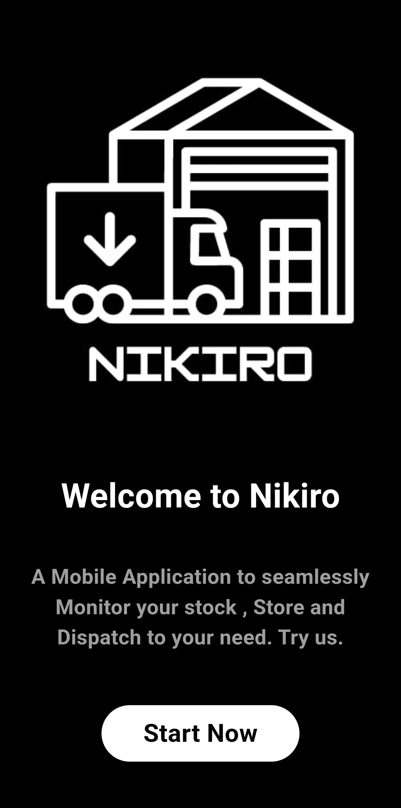
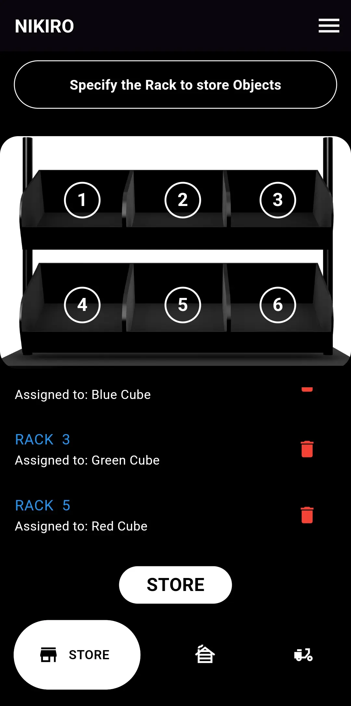
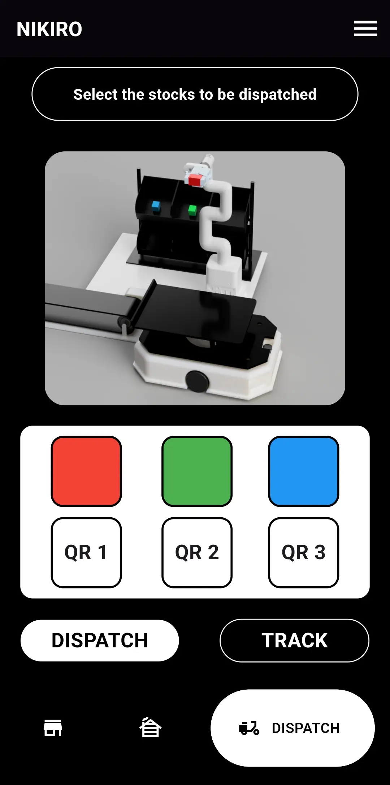
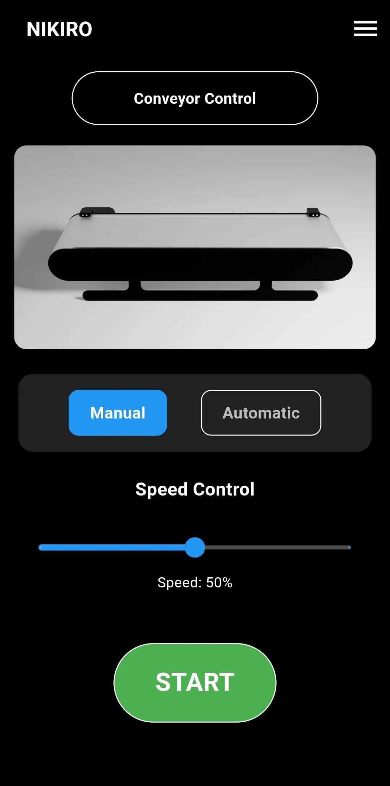
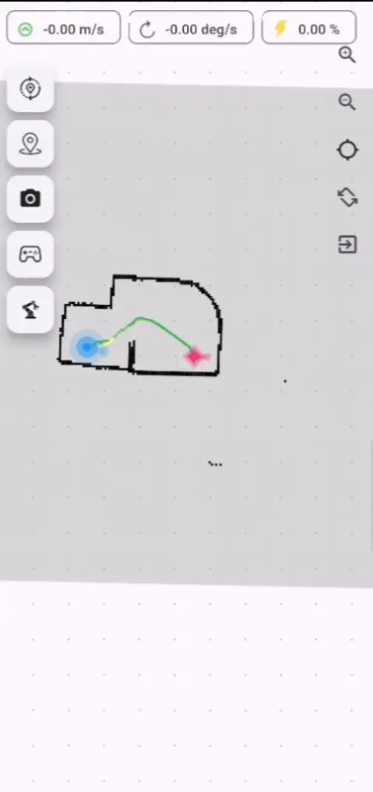
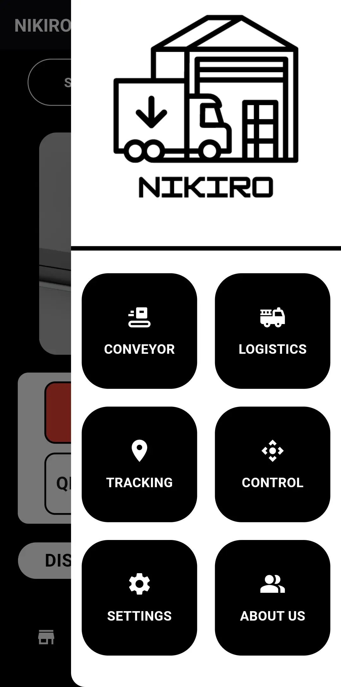

<div align="center">


# NIKIRO FLOW

### A Mobile Application to seamlessly Monitor your stock, Store and Dispatch to your need.

[](https://docs.ros.org/en/humble/)
[](https://www.elephantrobotics.com/en/mycobotpi-2023/)
[](https://nav2.ros.org/)
[](https://flutter.dev/)
[](LICENSE)

</div>

---

## Overview

**Nikiro Flow** is the mobile command center for the Nikiro AMR ecosystem — a full-stack warehouse automation platform. Through a single app, operators can assign storage racks, dispatch colored cubes via the MycoBot robotic arm, control the conveyor belt, and send navigation goals to the mobile robot — all in real time over ROS 2.

> Built as part of the Nikiro AMR project — integrating ROS 2, Nav2, MoveIt 2, Isaac Sim, and sensor fusion into a complete autonomous warehouse system.

<div align="center">
  
[](https://drive.google.com/drive/folders/1bPH7rO2QB6pT4xI9UttPIXCBFtYElgzi?usp=drive_link)

</div>


---

## Features

| Module | Description |
|---|---|
| 🏪 **Store** | Assign cubes to specific rack slots and trigger pick-and-place via MycoBot |
| 🚚 **Dispatch** | Select cubes by color, scan QR codes, and send dispatch commands to the AMR |
| 🗺️ **Tracking** | Visualize the live SLAM map, robot pose, planned path, and navigation status |
| 🎛️ **Conveyor Control** | Toggle Manual/Automatic mode and set belt speed via real-time slider |
| 🕹️ **Control** | Direct robot teleoperation and mission control |
| ⚙️ **Settings / About** | Configure ROS 2 bridge endpoint, robot IP, and app preferences |

---

## App Screens

<table>
  <tr>
    <td align="center"><b>Home</b></td>
    <td align="center"><b>Store — Rack Assignment</b></td>
    <td align="center"><b>Dispatch</b></td>
  </tr>
  <tr>
    <td></td>
    <td></td>
    <td></td>
  </tr>
  <tr>
    <td align="center"><b>Conveyor Control</b></td>
    <td align="center"><b>Live Map / Navigation</b></td>
    <td align="center"><b>Sidebar Menu</b></td>
  </tr>
  <tr>
    <td></td>
    <td></td>
    <td></td>
  </tr>
</table>

---

## System Architecture

```
Nikiro Flow App (Flutter)
        │
        │  WebSocket / rosbridge_suite
        ▼
   ROS 2 Bridge Node
   ┌────────────────────────────────────┐
   │  /store_command  (rack assignment) │
   │  /dispatch_cmd   (cube + QR goal)  │
   │  /conveyor_cmd   (speed + mode)    │
   │  /goal_pose      (Nav2 goal)       │
   │  /map, /amcl_pose, /plan (sub)     │
   └────────────────────────────────────┘
        │                   │
        ▼                   ▼
  MycoBot 280          Nikiro AMR
  (MoveIt 2 /          (Nav2 + SLAM
   MTC Pipeline)        Toolbox)
        │
        ▼
  Conveyor Belt
  (Speed-controlled
   object transport)
```

---

## Store Module

Tap a rack slot (1–6) on the 3D rack visualization to assign a cube color. Assigned mappings appear in the list below with a delete option. Hit **STORE** to publish the rack assignment to the MycoBot's MTC pick-and-place pipeline.

```
Rack 1  →  Blue Cube
Rack 3  →  Green Cube
Rack 5  →  Red Cube
```

The app publishes a custom ROS 2 message on `/store_command`, which the MycoBot node uses to select the correct grasp pose and target rack slot.

---

## Dispatch Module

Select one or more cubes by color (Red, Green, Blue) and assign a destination QR zone (QR 1–3). The AMR navigates to the QR waypoint, where the MycoBot places the cube onto the conveyor for outbound dispatch.

- **DISPATCH** — Sends goal to AMR + triggers arm motion
- **TRACK** — Switches to the live map view to follow the robot

---

## Conveyor Control Module

| Control | Description |
|---|---|
| **Manual** | Directly set belt speed via slider (0–100%) |
| **Automatic** | Belt activates automatically based on AMR arrival events |
| **START / STOP** | Toggle conveyor operation |

Publishes to `/conveyor_cmd` with `{mode, speed}` payload.

---

## Navigation / Tracking Module

Live map view powered by `nav2_msgs` and `sensor_msgs`:

- **Blue glow** — Current robot pose (AMCL)
- **Pink glow** — Active navigation goal
- **Green path** — Planned trajectory from Nav2

Toolbar actions: set pose, set goal, screenshot map, gamepad mode, arm control shortcut.

---

## ROS 2 Topics

| Topic | Type | Direction | Description |
|---|---|---|---|
| `/store_command` | `std_msgs/String` | Publish | Rack-to-cube assignment JSON |
| `/dispatch_cmd` | `std_msgs/String` | Publish | Dispatch target + QR zone |
| `/conveyor_cmd` | `std_msgs/String` | Publish | Belt mode and speed |
| `/goal_pose` | `geometry_msgs/PoseStamped` | Publish | Nav2 navigation goal |
| `/map` | `nav_msgs/OccupancyGrid` | Subscribe | SLAM map |
| `/amcl_pose` | `geometry_msgs/PoseWithCovarianceStamped` | Subscribe | Robot localization |
| `/plan` | `nav_msgs/Path` | Subscribe | Active Nav2 path |
| `/cmd_vel` | `geometry_msgs/Twist` | Publish | Manual teleop |

---

## Prerequisites

- **ROS 2 Humble** on the robot side
- **rosbridge_suite** running on the robot: `ros2 launch rosbridge_server rosbridge_websocket_launch.xml`
- **MycoBot 280** with MoveIt 2 + MTC pipeline configured
- **Nav2** stack running with SLAM Toolbox
- Flutter SDK for app development

---

## Getting Started

```bash
# Clone the repo
git clone https://github.com/logesh1516/nikiro_flow.git
cd nikiro_flow

# Install dependencies
flutter pub get

# Run on device
flutter run

# Build APK
flutter build apk --release
```

Configure the ROS bridge IP inside **Settings** once the app is running.

---

## Related Repositories

| Repo | Description |
|---|---|
| [Nikiro Simulation](https://github.com/logesh1516/Nikiro_simulation) | ROS 2 URDF, Nav2 config, SLAM Toolbox, Gazebo world |
| [Nikiro Docker](https://github.com/logesh1516/Nikiro_docker) | Dockerized ROS 2 environment for the full stack |
| [Nikiro Isaac Sim](https://github.com/logesh1516/nikiro_isaac_sim) | NVIDIA Isaac Sim integration with ROS 2 bridge |

---

## Author

**Logesh S**
Robotics & Automation Engineer

[](https://linkedin.com/in/logesh-s-17674824b)
[](https://github.com/logesh1516)
[](https://logesh1516.github.io)

---

<div align="center">
  <sub>Part of the Nikiro AMR Ecosystem — ROS 2 · Nav2 · MoveIt 2 · Isaac Sim · Flutter</sub>
</div>
